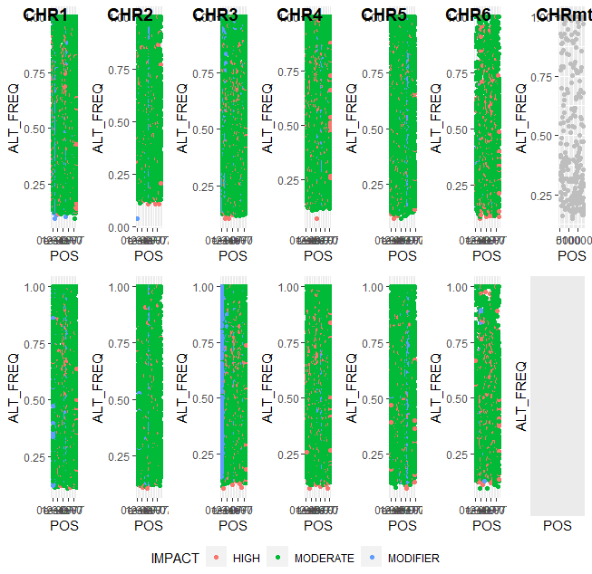

# Alignment, sorting and duplicate removal
The first step is aligning, sorting, indexing and removing duplicates from our alignment data
## Code
### Alignment, sorting and indexing
``` shell
#!/bin/bash -l
module load bioinfo-tools
module load bwa
module load samtools
module load picard
rec=/home/pauliusb/Cleandata/All_reads
bwa_db=/home/pauliusb/Haemonchus_2018_genome/BWA_all_genomes/haemonchus_cc
new_dir=/home/pauliusb/snic2020-16-116/alignment/WORKING_FOLDER
for sample in $rec/*R1.fq.gz
do
base=$(basename $sample R1.fq.gz)
echo "$base"
bwa mem -t 16 $bwa_db $rec/${base}R1.fq.gz $rec/${base}R2.fq.gz |
samtools view -b |
samtools sort --threads 8 -T temp > $new_dir/${base}R.bam
samtools index $new_dir/${base}R.bam

done
```
### Picard_tools and duplicate removal
```shell
for sample in $new_dir/*.bam
do
base=$(basename $sample .bam)
java -jar $PICARD_ROOT/picard.jar MarkDuplicates -I $sample -O $base.cleanreads.bam -REMOVE_DUPLICATES true -M .txt
samtools view -b -f 2 $base.cleanreads.bam > $base.final.bam
samtools sort $base.final.bam -o $base.final.sorted.bam
done
```
### Indexing reference genome
``` shell
samtools faidx /domus/h1/pauliusb/Haemonchus_2018_genome/haemonchusnewest.fa
```
### Making a joint mpileup
``` shell
samtools mpileup -d 500 --min-MQ 30 --min-BQ 30 --adjust-MQ 50 -f /domus/h1/pauliusb/Haemonchus_2018_genome/haemonchusnewest.fa \
I1_R.final.sorted.bam \
I2_R.final.sorted.bam \
I3_R.final.sorted.bam \
I4_R.final.sorted.bam \
P1_R.final.sorted.bam \
P2_R.final.sorted.bam \
P3_R.final.sorted.bam \
P4_R.final.sorted.bam \
-o $new_dir/IP.unchecked.mpileup
```
### Substituting hidden tabulations
``` shell
sed 's/\t\t/\t!\t!/g' $new_dir/IP.unchecked.mpileup > IP.final.mpileup
```
### Creating synchronized files
``` shell
module load popoolation2
mpileup2sync.pl --input IP.final.mpileup --min-qual 20 --output IP_filtered.sync
```
### CMH-test
``` shell
cmh-test.pl --input IP_filtered.sync --output IP_cmh.cmh --min-count 5 --min-coverage 20 --max-coverage 500 --population 1-5,2-6,3-7,4-8
cmh2gwas.pl --input IP_cmh.cmh --output IP_cmh.gwas --min-pvalue 1.0e-20
```

