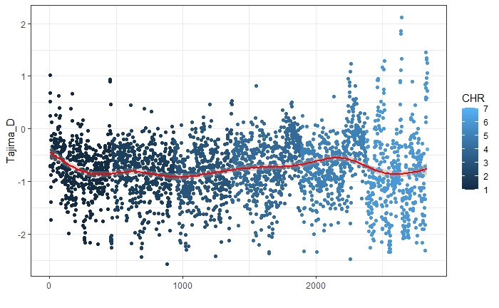
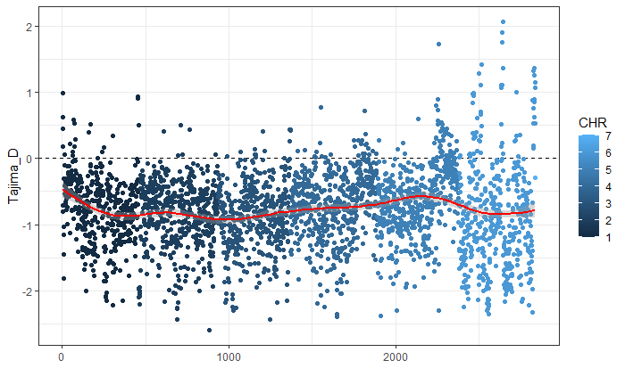
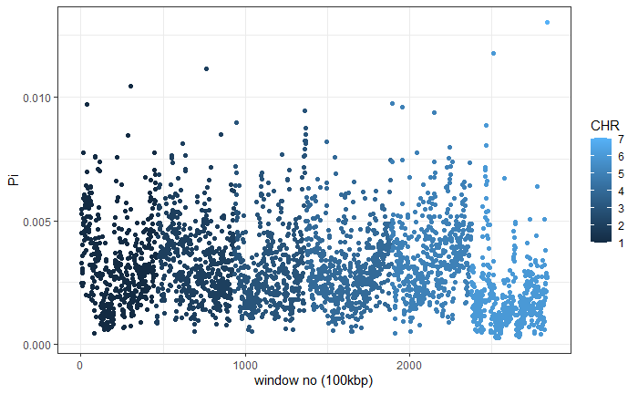

# Fst and Fet evaluation of mpileups
## Merging separate aligned .bam files into two "I" and "P"
``` shell
module load bioinfo-tools
module load samtools

samtools merge merged.I.bam -b list_bam_I.txt
samtools merge merged.P.bam -b list_bam_P.txt
```
## Generating mpileups
``` shell
samtools mpileup -d 500 --min-MQ 30 --min-BQ 30 --adjust-MQ 50 -f /domus/h1/pauliusb/Haemonchus_2018_genome/haemonchusnewest.fa \
merged.I.bam \
merged.P.bam \
-o IP2.unchecked.mpileup
sed 's/\t\t/\t!\t!/g' IP2.unchecked.mpileup > IP2.final.mpileup
```
## Spliting mpileups by sample (I or P) and chr
``` shell
less IP2.final.mpileup | cut -f 1,2,3,4,5,6 > I.only.mpileup
less IP2.final.mpileup | cut -f 1,2,3,7,8,9 > P.only.mpileup
```
### By chr for I
``` shell
grep "hcontortus_chr4_Celeg_TT_arrow_pilon" I.only.mpileup > I_CHR4.mpileup
grep "hcontortus_chr5_Celeg_TT_arrow_pilon" I.only.mpileup > I_CHR5.mpileup
grep "hcontortus_chr1_Celeg_TT_arrow_pilon" I.only.mpileup > I_CHR1.mpileup
grep "hcontortus_chr2_Celeg_TT_arrow_pilon" I.only.mpileup > I_CHR2.mpileup
grep "hcontortus_chr3_Celeg_TT_arrow_pilon" I.only.mpileup > I_CHR3.mpileup
grep "hcontortus_chrX_Celeg_TT_arrow_pilon" I.only.mpileup > I_CHRX.mpileup
grep "hcontortus_chr_mtDNA_arrow_pilon" I.only.mpileup > I_CHRMT.mpileup
```
### By chr for P
``` shell
grep "hcontortus_chr4_Celeg_TT_arrow_pilon" P.only.mpileup > P_CHR4.mpileup
grep "hcontortus_chr5_Celeg_TT_arrow_pilon" P.only.mpileup > P_CHR5.mpileup
grep "hcontortus_chr1_Celeg_TT_arrow_pilon" P.only.mpileup > P_CHR1.mpileup
grep "hcontortus_chr2_Celeg_TT_arrow_pilon" P.only.mpileup > P_CHR2.mpileup
grep "hcontortus_chr3_Celeg_TT_arrow_pilon" P.only.mpileup > P_CHR3.mpileup
grep "hcontortus_chrX_Celeg_TT_arrow_pilon" P.only.mpileup > P_CHRX.mpileup
grep "hcontortus_chr_mtDNA_arrow_pilon" P.only.mpileup > P_CHRMT.mpileup
```
## Npstat/1
``` shell
module load NPStat/1
for i in *_CHR*
do
npstat -n 200 -l 100000 -maxcov 300 -minqual 20 $i
done
```
### Tajima's D vs 100kbp windows and nucleotide diversity (Pi) for "I"


### Tajima's D vs 100kbp windows and nucleotide diversity (Pi) for "P"



## Syncing
``` shell
module load bcftools
module load popoolation2
mpileup2sync.pl --input IP2.final.mpileup --min-qual 20 --output IP2_filtered.sync
```
## Finding +5 bp indels and removing them from the synced files
``` shell
perl /sw/bioinfo/popoolation2/1201/rackham/indel_filtering/identify-indel-regions.pl --min-count 2 --indel-window 5 --input IP2.final.mpileup --output indels.gtf
perl /sw/bioinfo/popoolation2/1201/rackham/indel_filtering/filter-sync-by-gtf.pl --input IP2_filtered.sync --output IP_noindels.sync --gtf indels.gtf
```
## Fst and Fet calculations
``` shell
popoolation2 perl /sw/bioinfo/popoolation2/1201/rackham/fst-sliding.pl --input IP_noindels.sync --output IP2.fst --pool-size 100 --window-size 10000 --step-size 5000 --min-count 4 --min-coverage 50 --max-coverage 2%
popoolation2 perl perl /sw/bioinfo/popoolation2/1201/rackham/fisher-test.pl --input IP_noindels.sync --output IP2.fet  --min-count 4 --min-coverage 20 --max coverage 2% --suppress-noninformative
```
