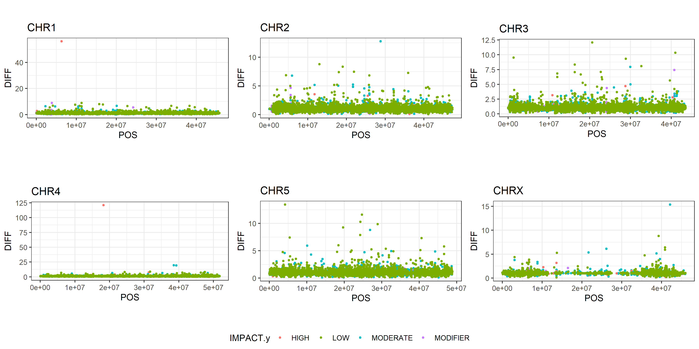

# Alignment, sorting and duplicate removal
The first step is aligning, sorting, indexing and removing duplicates from our alignment data
## Code
### Alignment, sorting and indexing
``` shell
#!/bin/bash -l
module load bioinfo-tools
module load bwa
module load samtools
module load picard
rec=/home/pauliusb/Cleandata/All_reads
bwa_db=/home/pauliusb/Haemonchus_2018_genome/BWA_all_genomes/haemonchus_cc
new_dir=/home/pauliusb/snic2020-16-116/alignment/WORKING_FOLDER
for sample in $rec/*R1.fq.gz
do
base=$(basename $sample R1.fq.gz)
echo "$base"
bwa mem -t 16 $bwa_db $rec/${base}R1.fq.gz $rec/${base}R2.fq.gz |
samtools view -b |
samtools sort --threads 8 -T temp > $new_dir/${base}R.bam
samtools index $new_dir/${base}R.bam

done
```
### Picard_tools and duplicate removal
```shell
for sample in $new_dir/*.bam
do
base=$(basename $sample .bam)
java -jar $PICARD_ROOT/picard.jar MarkDuplicates -I $sample -O $base.cleanreads.bam -REMOVE_DUPLICATES true -M .txt
samtools view -b -f 2 $base.cleanreads.bam > $base.final.bam
samtools sort $base.final.bam -o $base.final.sorted.bam
done
```
### Merging .bam files into (pre=I and post=P) two categories
``` shell
samtools merge merged.I.bam -b listI_bam_files.txt
samtools merge merged.P.bam -b listP_bam_files.txt
```
### Indexing reference genome
``` shell
samtools faidx /domus/h1/pauliusb/Haemonchus_2018_genome/haemonchusnewest.fa
```
### SNP calling and quality filtering
``` shell
ref=/domus/h1/pauliusb/Haemonchus_2018_genome/haemonchusnewest.fa
bamfile1=/domus/h1/pauliusb/snic2020-16-116/alignment/WORKING_FOLDER/merged.I.bam
bamfile2=/domus/h1/pauliusb/snic2020-16-116/alignment/WORKING_FOLDER/merged.P.bam
bcftools mpileup -d 500 --min-MQ 30 --min-BQ 30 --adjust-MQ 50 -a FORMAT/DP -f $ref $bamfile1 $bamfile2 | bcftools call -mv -Ov -o IP_calledvar.vcf
bcftools view -i '%QUAL>=20 & FORMAT/DP>=20' IP_calledvar.vcf -o IP_calledvar.qualdp20.vcf
```
### Spliting a .vcf
``` shell
bcftools view -s /domus/h1/pauliusb/snic2020-16-116/alignment/WORKING_FOLDER/merged.I.bam IP_calledvar.qualdp20.vcf > Jul16.merged.I.vcf
bcftools view -s /domus/h1/pauliusb/snic2020-16-116/alignment/WORKING_FOLDER/merged.P.bam IP_calledvar.qualdp20.vcf > Jul16.merged.P.vcf
```
### OPTIONAL Retaining only INFO/DP4s to calculate allele frequencies for .vcfs 
``` shell
bcftools annotate -x FORMAT,^INFO/DP4 merged.I.vcf > merged.I.ann.vcf
bcftools annotate -x FORMAT,^INFO/DP4 merged.P.vcf > merged.P.ann.vcf
```
### Creating Haemonchus c. database on snpEFF
``` shell
module load bioinfo-tools
module load snpEff/4.3t
java -jar $SNPEFF_ROOT/snpEff.jar build -c Heacon.config -dataDir Heacon_data -gff3 GCA_000469685.2
```
### SNP annotating
``` shell
java -jar $SNPEFF_ROOT/snpEff.jar -dataDir Heacon_data -c Heacon.config -v GCA_000469685.2 Jul16.merged.I.vcf > Jul16.merged.I.annotated.vcf
java -jar $SNPEFF_ROOT/snpEff.jar -dataDir Heacon_data -c Heacon.config -v GCA_000469685.2 Jul16.merged.P.vcf > Jul16.merged.P.annotated.vcf
```

### Extracting CHR, POS, DP, DP4 and other important info (+filtering) step-by-step
``` shell
more merged.P.final.vcf | cut -f 1,2,4,5,8,10 | sed 's/|/\t/g'| cut -f 1,2,3,4,5,6,7,8,9 | grep -v "intergenic\|stream\|UTR\|intron_variant"| grep -v "##" | sed 's/;/\t/g' > P.merged.vcf
```
#### looking into the frequencies table with less


### ggplot script (importing, blank cell removal, filtering on allele frequency >0 and the sum of DP4>19)
``` shell
library(tidyverse)
library(dplyr)
library(ggpubr)

I_raw<-read.delim2('L:/SNP_call/I.vcf')
I_blank_removal<- I_raw[,c(1:13)]
I_all0<- dplyr::filter(I_blank_removal,ALL>0)
I<-dplyr::filter(I_all0,SUM>19)
P_raw<-read.delim2('L:/SNP_call/P.vcf')
P_blank_removal<- P_raw[,c(1:13)]
P_all0<- dplyr::filter(P_blank_removal,ALL>0)
P<-dplyr::filter(P_all0,SUM>19)

# Split 'I' by chromosome
I_split<-split(I, I$CHR)
I1<-I_split$`1`
I2<-I_split$`2`
I3<-I_split$`3`
I4<-I_split$`4`
I5<-I_split$`5`
I6<-I_split$`X`

# Split 'I_split' by mutation type (syn.,non-syn.,stop-codon lost, frameshift, etc.)
I1_split<-split(I1, I1$TYPE)
I2_split<-split(I2, I2$TYPE)
I3_split<-split(I3, I3$TYPE)
I4_split<-split(I4, I4$TYPE)
I5_split<-split(I5, I5$TYPE)
I6_split<-split(I6, I6$TYPE)

# Split "P" by chromosome
P_split<-split(P, P$CHR)
P0<-P_split$`0`
P1<-P_split$`1`
P2<-P_split$`2`
P3<-P_split$`3`
P4<-P_split$`4`
P5<-P_split$`5`
P6<-P_split$`X`
# Split "P_split" by mutation type (syn.,non-syn.,stop-codon lost, frameshift, etc.)
P1_split<-split(P1, P1$TYPE)
P2_split<-split(P2, P2$TYPE)
P3_split<-split(P3, P3$TYPE)
P4_split<-split(P4, P4$TYPE)
P5_split<-split(P5, P5$TYPE)
P6_split<-split(P6, P6$TYPE)

# CHR 1 Join I1_split with P1_split for every mutation type by POS

IP1a<-dplyr::inner_join(I1_split$conservative_inframe_deletion,P1_split$conservative_inframe_deletion, by="POS")
IP1b<-dplyr::inner_join(I1_split$conservative_inframe_insertion,P1_split$conservative_inframe_insertion, by="POS")
IP1c<-dplyr::inner_join(I1_split$`conservative_inframe_insertion&splice_region_variant`,P1_split$`conservative_inframe_insertion&splice_region_variant`, by="POS")
IP1d<-dplyr::inner_join(I1_split$disruptive_inframe_deletion,P1_split$disruptive_inframe_deletion, by="POS")
IP1e<-dplyr::inner_join(I1_split$`disruptive_inframe_deletion&splice_region_variant`,P1_split$`disruptive_inframe_deletion&splice_region_variant`,by="POS")
IP1f<-inner_join(I1_split$disruptive_inframe_insertion,P1_split$disruptive_inframe_insertion,by="POS")
IP1g<-inner_join(I1_split$`disruptive_inframe_insertion&splice_region_variant`,P1_split$`disruptive_inframe_insertion&splice_region_variant`,by="POS")
IP1h<-inner_join(I1_split$`exon_loss_variant&splice_region_variant`,P1_split$`exon_loss_variant&splice_region_variant`, by="POS")
IP1i<-inner_join(I1_split$frameshift_variant,P1_split$frameshift_variant, by="POS")
IP1j<-inner_join(I1_split$`frameshift_variant&splice_region_variant`,P1_split$`frameshift_variant&splice_region_variant`,by="POS")
IP1k<-inner_join(I1_split$`frameshift_variant&start_lost`,P1_split$`frameshift_variant&start_lost`,by="POS")
IP1l<-inner_join(I1_split$`frameshift_variant&stop_gained`,P1_split$`frameshift_variant&stop_gained`,by="POS")
IP1m<-inner_join(I1_split$`frameshift_variant&stop_lost`,P1_split$`frameshift_variant&stop_lost`,by="POS")
IP1n<-inner_join(I1_split$`frameshift_variant&stop_lost&splice_region_variant`,P1_split$`frameshift_variant&stop_lost&splice_region_variant`, by="POS")
IP1o<-inner_join(I1_split$gene_fusion,P1_split$gene_fusion, by="POS")
IP1p<-inner_join(I1_split$initiator_codon_variant,P1_split$initiator_codon_variant,by="POS")
IP1q<-inner_join(I1_split$intragenic_variant,P1_split$intragenic_variant,by="POS")
IP1r<-inner_join(I1_split$missense_variant,P1_split$missense_variant,by="POS")
IP1s<-inner_join(I1_split$`missense_variant&splice_region_variant`,P1_split$`missense_variant&splice_region_variant`,by="POS")
IP1u<-inner_join(I1_split$`splice_region_variant&non_coding_transcript_exon_variant`,P1_split$`splice_region_variant&non_coding_transcript_exon_variant`,by="POS")
IP1v<-inner_join(I1_split$`splice_region_variant&stop_retained_variant`,P1_split$`splice_region_variant&stop_retained_variant`,by="POS")
IP1w<-inner_join(I1_split$`splice_region_variant&synonymous_variant`,P1_split$`splice_region_variant&synonymous_variant`,by="POS")
IP1x<-inner_join(I1_split$start_lost,P1_split$start_lost,by="POS")
IP1aa<-inner_join(I1_split$stop_gained,P1_split$stop_gained,by="POS")
IP1bb<-inner_join(I1_split$`stop_gained&conservative_inframe_insertion`,P1_split$`stop_gained&conservative_inframe_insertion`,by="POS")
IP1ee<-inner_join(I1_split$`stop_gained&splice_region_variant`,P1_split$`stop_gained&splice_region_variant`,by="POS")
IP1ff<-inner_join(I1_split$stop_lost,P1_split$stop_lost,by="POS")
IP1ii<-inner_join(I1_split$`stop_lost&splice_region_variant`,P1_split$`stop_lost&splice_region_variant`,by="POS")
IP1jj<-inner_join(I1_split$stop_retained_variant,P1_split$stop_retained_variant,by="POS")
IP1kk<-inner_join(I1_split$synonymous_variant,P1_split$synonymous_variant,by="POS")

# Combine IP1.. into 1 data frame
IP1<-dplyr::bind_rows(IP1a,IP1b,IP1c,IP1d,IP1e,IP1f,IP1g,IP1h,IP1i,IP1j,IP1k,IP1l,IP1m,IP1n,IP1o,IP1p,IP1q,IP1r,IP1s,IP1u,IP1v,IP1w,IP1x,
                      IP1aa,IP1bb,IP1ee,IP1ff,IP1ii,IP1jj,IP1kk)
# Calculate allele frequency differences between 'I' and 'P'.
IP1_diff<-dplyr::mutate(IP1,DIFF=ALL.y/ALL.x)

# CHR 2

IP2a<-dplyr::inner_join(I2_split$conservative_inframe_deletion,P2_split$conservative_inframe_deletion, by="POS")
IP2b<-dplyr::inner_join(I2_split$conservative_inframe_insertion,P2_split$conservative_inframe_insertion, by="POS")
IP2c<-dplyr::inner_join(I2_split$`conservative_inframe_insertion&splice_region_variant`,P2_split$`conservative_inframe_insertion&splice_region_variant`, by="POS")
IP2d<-dplyr::inner_join(I2_split$disruptive_inframe_deletion,P2_split$disruptive_inframe_deletion, by="POS")
IP2e<-dplyr::inner_join(I2_split$`disruptive_inframe_deletion&splice_region_variant`,P2_split$`disruptive_inframe_deletion&splice_region_variant`,by="POS")
IP2f<-inner_join(I2_split$disruptive_inframe_insertion,P2_split$disruptive_inframe_insertion,by="POS")
IP2g<-inner_join(I2_split$`disruptive_inframe_insertion&splice_region_variant`,P2_split$`disruptive_inframe_insertion&splice_region_variant`,by="POS")
IP2h<-inner_join(I2_split$`exon_loss_variant&splice_region_variant`,P2_split$`exon_loss_variant&splice_region_variant`, by="POS")
IP2i<-inner_join(I2_split$frameshift_variant,P2_split$frameshift_variant, by="POS")
IP2j<-inner_join(I2_split$`frameshift_variant&splice_region_variant`,P2_split$`frameshift_variant&splice_region_variant`,by="POS")
IP2k<-inner_join(I2_split$`frameshift_variant&start_lost`,P2_split$`frameshift_variant&start_lost`,by="POS")
IP2l<-inner_join(I2_split$`frameshift_variant&stop_gained`,P2_split$`frameshift_variant&stop_gained`,by="POS")
IP2m<-inner_join(I2_split$`frameshift_variant&stop_lost`,P2_split$`frameshift_variant&stop_lost`,by="POS")
IP2n<-inner_join(I2_split$`frameshift_variant&stop_lost&splice_region_variant`,P2_split$`frameshift_variant&stop_lost&splice_region_variant`, by="POS")
IP2o<-inner_join(I2_split$gene_fusion,P2_split$gene_fusion, by="POS")
IP2p<-inner_join(I2_split$initiator_codon_variant,P2_split$initiator_codon_variant,by="POS")
IP2q<-inner_join(I2_split$intragenic_variant,P2_split$intragenic_variant,by="POS")
IP2r<-inner_join(I2_split$missense_variant,P2_split$missense_variant,by="POS")
IP2s<-inner_join(I2_split$`missense_variant&splice_region_variant`,P2_split$`missense_variant&splice_region_variant`,by="POS")
IP2u<-inner_join(I2_split$`splice_region_variant&non_coding_transcript_exon_variant`,P2_split$`splice_region_variant&non_coding_transcript_exon_variant`,by="POS")
IP2v<-inner_join(I2_split$`splice_region_variant&stop_retained_variant`,P2_split$`splice_region_variant&stop_retained_variant`,by="POS")
IP2w<-inner_join(I2_split$`splice_region_variant&synonymous_variant`,P2_split$`splice_region_variant&synonymous_variant`,by="POS")
IP2x<-inner_join(I2_split$start_lost,P2_split$start_lost,by="POS")
IP2aa<-inner_join(I2_split$stop_gained,P2_split$stop_gained,by="POS")
IP2bb<-inner_join(I2_split$`stop_gained&conservative_inframe_insertion`,P2_split$`stop_gained&conservative_inframe_insertion`,by="POS")
IP2ee<-inner_join(I2_split$`stop_gained&splice_region_variant`,P2_split$`stop_gained&splice_region_variant`,by="POS")
IP2ff<-inner_join(I2_split$stop_lost,P2_split$stop_lost,by="POS")
IP2ii<-inner_join(I2_split$`stop_lost&splice_region_variant`,P2_split$`stop_lost&splice_region_variant`,by="POS")
IP2jj<-inner_join(I2_split$stop_retained_variant,P2_split$stop_retained_variant,by="POS")
IP2kk<-inner_join(I2_split$synonymous_variant,P2_split$synonymous_variant,by="POS")

# Combine IP2.. into 1 data frame
IP2<-dplyr::bind_rows(IP2a,IP2b,IP2c,IP2d,IP2e,IP2f,IP2g,IP2h,IP2i,IP2j,IP2k,IP2l,IP2m,IP2n,IP2o,IP2p,IP2q,IP2r,IP2s,IP2u,IP2v,IP2w,IP2x,
                      IP2aa,IP2bb,IP2ee,IP2ff,IP2ii,IP2jj,IP2kk)
# Calculate allele frequency differences
IP2_diff<-dplyr::mutate(IP2,DIFF=ALL.y/ALL.x)

#CHR 3

IP3a<-dplyr::inner_join(I3_split$conservative_inframe_deletion,P3_split$conservative_inframe_deletion, by="POS")
IP3b<-dplyr::inner_join(I3_split$conservative_inframe_insertion,P3_split$conservative_inframe_insertion, by="POS")
IP3c<-dplyr::inner_join(I3_split$`conservative_inframe_insertion&splice_region_variant`,P3_split$`conservative_inframe_insertion&splice_region_variant`, by="POS")
IP3d<-dplyr::inner_join(I3_split$disruptive_inframe_deletion,P3_split$disruptive_inframe_deletion, by="POS")
IP3e<-dplyr::inner_join(I3_split$`disruptive_inframe_deletion&splice_region_variant`,P3_split$`disruptive_inframe_deletion&splice_region_variant`,by="POS")
IP3f<-inner_join(I3_split$disruptive_inframe_insertion,P3_split$disruptive_inframe_insertion,by="POS")
IP3g<-inner_join(I3_split$`disruptive_inframe_insertion&splice_region_variant`,P3_split$`disruptive_inframe_insertion&splice_region_variant`,by="POS")
IP3h<-inner_join(I3_split$`exon_loss_variant&splice_region_variant`,P3_split$`exon_loss_variant&splice_region_variant`, by="POS")
IP3i<-inner_join(I3_split$frameshift_variant,P3_split$frameshift_variant, by="POS")
IP3j<-inner_join(I3_split$`frameshift_variant&splice_region_variant`,P3_split$`frameshift_variant&splice_region_variant`,by="POS")
IP3k<-inner_join(I3_split$`frameshift_variant&start_lost`,P3_split$`frameshift_variant&start_lost`,by="POS")
IP3l<-inner_join(I3_split$`frameshift_variant&stop_gained`,P3_split$`frameshift_variant&stop_gained`,by="POS")
IP3m<-inner_join(I3_split$`frameshift_variant&stop_lost`,P3_split$`frameshift_variant&stop_lost`,by="POS")
IP3n<-inner_join(I3_split$`frameshift_variant&stop_lost&splice_region_variant`,P3_split$`frameshift_variant&stop_lost&splice_region_variant`, by="POS")
IP3o<-inner_join(I3_split$gene_fusion,P3_split$gene_fusion, by="POS")
IP3p<-inner_join(I3_split$initiator_codon_variant,P3_split$initiator_codon_variant,by="POS")
IP3q<-inner_join(I3_split$intragenic_variant,P3_split$intragenic_variant,by="POS")
IP3r<-inner_join(I3_split$missense_variant,P3_split$missense_variant,by="POS")
IP3s<-inner_join(I3_split$`missense_variant&splice_region_variant`,P3_split$`missense_variant&splice_region_variant`,by="POS")
IP3u<-inner_join(I3_split$`splice_region_variant&non_coding_transcript_exon_variant`,P3_split$`splice_region_variant&non_coding_transcript_exon_variant`,by="POS")
IP3v<-inner_join(I3_split$`splice_region_variant&stop_retained_variant`,P3_split$`splice_region_variant&stop_retained_variant`,by="POS")
IP3w<-inner_join(I3_split$`splice_region_variant&synonymous_variant`,P3_split$`splice_region_variant&synonymous_variant`,by="POS")
IP3x<-inner_join(I3_split$start_lost,P3_split$start_lost,by="POS")
IP3aa<-inner_join(I3_split$stop_gained,P3_split$stop_gained,by="POS")
IP3bb<-inner_join(I3_split$`stop_gained&conservative_inframe_insertion`,P3_split$`stop_gained&conservative_inframe_insertion`,by="POS")
IP3ee<-inner_join(I3_split$`stop_gained&splice_region_variant`,P3_split$`stop_gained&splice_region_variant`,by="POS")
IP3ff<-inner_join(I3_split$stop_lost,P3_split$stop_lost,by="POS")
IP3ii<-inner_join(I3_split$`stop_lost&splice_region_variant`,P3_split$`stop_lost&splice_region_variant`,by="POS")
IP3jj<-inner_join(I3_split$stop_retained_variant,P3_split$stop_retained_variant,by="POS")
IP3kk<-inner_join(I3_split$synonymous_variant,P3_split$synonymous_variant,by="POS")

# Combine IP3.. into 1 data frame
IP3<-dplyr::bind_rows(IP3a,IP3b,IP3c,IP3d,IP3e,IP3f,IP3g,IP3h,IP3i,IP3j,IP3k,IP3l,IP3m,IP3n,IP3o,IP3p,IP3q,IP3r,IP3s,IP3u,IP3v,IP3w,IP3x,
                      IP3aa,IP3bb,IP3ee,IP3ff,IP3ii,IP3jj,IP3kk)
# Calculate allele frequency differences
IP3_diff<-dplyr::mutate(IP3,DIFF=ALL.y/ALL.x)

# CHR 4

IP4a<-dplyr::inner_join(I4_split$conservative_inframe_deletion,P4_split$conservative_inframe_deletion, by="POS")
IP4b<-dplyr::inner_join(I4_split$conservative_inframe_insertion,P4_split$conservative_inframe_insertion, by="POS")
IP4c<-dplyr::inner_join(I4_split$`conservative_inframe_insertion&splice_region_variant`,P4_split$`conservative_inframe_insertion&splice_region_variant`, by="POS")
IP4d<-dplyr::inner_join(I4_split$disruptive_inframe_deletion,P4_split$disruptive_inframe_deletion, by="POS")
IP4e<-dplyr::inner_join(I4_split$`disruptive_inframe_deletion&splice_region_variant`,P4_split$`disruptive_inframe_deletion&splice_region_variant`,by="POS")
IP4f<-inner_join(I4_split$disruptive_inframe_insertion,P4_split$disruptive_inframe_insertion,by="POS")
IP4g<-inner_join(I4_split$`disruptive_inframe_insertion&splice_region_variant`,P4_split$`disruptive_inframe_insertion&splice_region_variant`,by="POS")
IP4h<-inner_join(I4_split$`exon_loss_variant&splice_region_variant`,P4_split$`exon_loss_variant&splice_region_variant`, by="POS")
IP4i<-inner_join(I4_split$frameshift_variant,P4_split$frameshift_variant, by="POS")
IP4j<-inner_join(I4_split$`frameshift_variant&splice_region_variant`,P4_split$`frameshift_variant&splice_region_variant`,by="POS")
IP4k<-inner_join(I4_split$`frameshift_variant&start_lost`,P4_split$`frameshift_variant&start_lost`,by="POS")
IP4l<-inner_join(I4_split$`frameshift_variant&stop_gained`,P4_split$`frameshift_variant&stop_gained`,by="POS")
IP4m<-inner_join(I4_split$`frameshift_variant&stop_lost`,P4_split$`frameshift_variant&stop_lost`,by="POS")
IP4n<-inner_join(I4_split$`frameshift_variant&stop_lost&splice_region_variant`,P4_split$`frameshift_variant&stop_lost&splice_region_variant`, by="POS")
IP4o<-inner_join(I4_split$gene_fusion,P4_split$gene_fusion, by="POS")
IP4p<-inner_join(I4_split$initiator_codon_variant,P4_split$initiator_codon_variant,by="POS")
IP4q<-inner_join(I4_split$intragenic_variant,P4_split$intragenic_variant,by="POS")
IP4r<-inner_join(I4_split$missense_variant,P4_split$missense_variant,by="POS")
IP4s<-inner_join(I4_split$`missense_variant&splice_region_variant`,P4_split$`missense_variant&splice_region_variant`,by="POS")
IP4u<-inner_join(I4_split$`splice_region_variant&non_coding_transcript_exon_variant`,P4_split$`splice_region_variant&non_coding_transcript_exon_variant`,by="POS")
IP4v<-inner_join(I4_split$`splice_region_variant&stop_retained_variant`,P4_split$`splice_region_variant&stop_retained_variant`,by="POS")
IP4w<-inner_join(I4_split$`splice_region_variant&synonymous_variant`,P4_split$`splice_region_variant&synonymous_variant`,by="POS")
IP4x<-inner_join(I4_split$start_lost,P4_split$start_lost,by="POS")
IP4aa<-inner_join(I4_split$stop_gained,P4_split$stop_gained,by="POS")
IP4bb<-inner_join(I4_split$`stop_gained&conservative_inframe_insertion`,P4_split$`stop_gained&conservative_inframe_insertion`,by="POS")
IP4ee<-inner_join(I4_split$`stop_gained&splice_region_variant`,P4_split$`stop_gained&splice_region_variant`,by="POS")
IP4ff<-inner_join(I4_split$stop_lost,P4_split$stop_lost,by="POS")
IP4ii<-inner_join(I4_split$`stop_lost&splice_region_variant`,P4_split$`stop_lost&splice_region_variant`,by="POS")
IP4jj<-inner_join(I4_split$stop_retained_variant,P4_split$stop_retained_variant,by="POS")
IP4kk<-inner_join(I4_split$synonymous_variant,P4_split$synonymous_variant,by="POS")

# Combine IP4.. into 1 data frame
IP4<-dplyr::bind_rows(IP4a,IP4b,IP4c,IP4d,IP4e,IP4f,IP4g,IP4h,IP4i,IP4j,IP4k,IP4l,IP4m,IP4n,IP4o,IP4p,IP4q,IP4r,IP4s,IP4u,IP4v,IP4w,IP4x,
                      IP4aa,IP4bb,IP4ee,IP4ff,IP4ii,IP4jj,IP4kk)
# Calculate allele frequency differences
IP4_diff<-dplyr::mutate(IP4,DIFF=ALL.y/ALL.x)


# CHR 5

IP5a<-dplyr::inner_join(I5_split$conservative_inframe_deletion,P5_split$conservative_inframe_deletion, by="POS")
IP5b<-dplyr::inner_join(I5_split$conservative_inframe_insertion,P5_split$conservative_inframe_insertion, by="POS")
IP5c<-dplyr::inner_join(I5_split$`conservative_inframe_insertion&splice_region_variant`,P5_split$`conservative_inframe_insertion&splice_region_variant`, by="POS")
IP5d<-dplyr::inner_join(I5_split$disruptive_inframe_deletion,P5_split$disruptive_inframe_deletion, by="POS")
IP5e<-dplyr::inner_join(I5_split$`disruptive_inframe_deletion&splice_region_variant`,P5_split$`disruptive_inframe_deletion&splice_region_variant`,by="POS")
IP5f<-inner_join(I5_split$disruptive_inframe_insertion,P5_split$disruptive_inframe_insertion,by="POS")
IP5g<-inner_join(I5_split$`disruptive_inframe_insertion&splice_region_variant`,P5_split$`disruptive_inframe_insertion&splice_region_variant`,by="POS")
IP5h<-inner_join(I5_split$`exon_loss_variant&splice_region_variant`,P5_split$`exon_loss_variant&splice_region_variant`, by="POS")
IP5i<-inner_join(I5_split$frameshift_variant,P5_split$frameshift_variant, by="POS")
IP5j<-inner_join(I5_split$`frameshift_variant&splice_region_variant`,P5_split$`frameshift_variant&splice_region_variant`,by="POS")
IP5k<-inner_join(I5_split$`frameshift_variant&start_lost`,P5_split$`frameshift_variant&start_lost`,by="POS")
IP5l<-inner_join(I5_split$`frameshift_variant&stop_gained`,P5_split$`frameshift_variant&stop_gained`,by="POS")
IP5m<-inner_join(I5_split$`frameshift_variant&stop_lost`,P5_split$`frameshift_variant&stop_lost`,by="POS")
IP5n<-inner_join(I5_split$`frameshift_variant&stop_lost&splice_region_variant`,P5_split$`frameshift_variant&stop_lost&splice_region_variant`, by="POS")
IP5o<-inner_join(I5_split$gene_fusion,P5_split$gene_fusion, by="POS")
IP5p<-inner_join(I5_split$initiator_codon_variant,P5_split$initiator_codon_variant,by="POS")
IP5q<-inner_join(I5_split$intragenic_variant,P5_split$intragenic_variant,by="POS")
IP5r<-inner_join(I5_split$missense_variant,P5_split$missense_variant,by="POS")
IP5s<-inner_join(I5_split$`missense_variant&splice_region_variant`,P5_split$`missense_variant&splice_region_variant`,by="POS")
IP5u<-inner_join(I5_split$`splice_region_variant&non_coding_transcript_exon_variant`,P5_split$`splice_region_variant&non_coding_transcript_exon_variant`,by="POS")
IP5v<-inner_join(I5_split$`splice_region_variant&stop_retained_variant`,P5_split$`splice_region_variant&stop_retained_variant`,by="POS")
IP5w<-inner_join(I5_split$`splice_region_variant&synonymous_variant`,P5_split$`splice_region_variant&synonymous_variant`,by="POS")
IP5x<-inner_join(I5_split$start_lost,P5_split$start_lost,by="POS")
IP5aa<-inner_join(I5_split$stop_gained,P5_split$stop_gained,by="POS")
IP5bb<-inner_join(I5_split$`stop_gained&conservative_inframe_insertion`,P5_split$`stop_gained&conservative_inframe_insertion`,by="POS")
IP5ee<-inner_join(I5_split$`stop_gained&splice_region_variant`,P5_split$`stop_gained&splice_region_variant`,by="POS")
IP5ff<-inner_join(I5_split$stop_lost,P5_split$stop_lost,by="POS")
IP5ii<-inner_join(I5_split$`stop_lost&splice_region_variant`,P5_split$`stop_lost&splice_region_variant`,by="POS")
IP5jj<-inner_join(I5_split$stop_retained_variant,P5_split$stop_retained_variant,by="POS")
IP5kk<-inner_join(I5_split$synonymous_variant,P5_split$synonymous_variant,by="POS")

# Combine IP5.. into 1 data frame
IP5<-dplyr::bind_rows(IP5a,IP5b,IP5c,IP5d,IP5e,IP5f,IP5g,IP5h,IP5i,IP5j,IP5k,IP5l,IP5m,IP5n,IP5o,IP5p,IP5q,IP5r,IP5s,IP5t,IP5u,IP5v,IP5w,IP5x,
                      IP5y,IP5z,IP5aa,IP5bb,IP5cc,IP5dd,IP5ee,IP5ff,IP5gg,IP5hh,IP5ii,IP5jj,IP5kk)

# Calculate allele frequency differences
IP5_diff<-dplyr::mutate(IP5,DIFF=ALL.y/ALL.x)

#CHR X

IP6a<-dplyr::inner_join(I6_split$conservative_inframe_deletion,P6_split$conservative_inframe_deletion, by="POS")
IP6b<-dplyr::inner_join(I6_split$conservative_inframe_insertion,P6_split$conservative_inframe_insertion, by="POS")
IP6c<-dplyr::inner_join(I6_split$`conservative_inframe_insertion&splice_region_variant`,P6_split$`conservative_inframe_insertion&splice_region_variant`, by="POS")
IP6d<-dplyr::inner_join(I6_split$disruptive_inframe_deletion,P6_split$disruptive_inframe_deletion, by="POS")
IP6e<-dplyr::inner_join(I6_split$`disruptive_inframe_deletion&splice_region_variant`,P6_split$`disruptive_inframe_deletion&splice_region_variant`,by="POS")
IP6f<-inner_join(I6_split$disruptive_inframe_insertion,P6_split$disruptive_inframe_insertion,by="POS")
IP6g<-inner_join(I6_split$`disruptive_inframe_insertion&splice_region_variant`,P6_split$`disruptive_inframe_insertion&splice_region_variant`,by="POS")
IP6h<-inner_join(I6_split$`exon_loss_variant&splice_region_variant`,P6_split$`exon_loss_variant&splice_region_variant`, by="POS")
IP6i<-inner_join(I6_split$frameshift_variant,P6_split$frameshift_variant, by="POS")
IP6j<-inner_join(I6_split$`frameshift_variant&splice_region_variant`,P6_split$`frameshift_variant&splice_region_variant`,by="POS")
IP6k<-inner_join(I6_split$`frameshift_variant&start_lost`,P6_split$`frameshift_variant&start_lost`,by="POS")
IP6l<-inner_join(I6_split$`frameshift_variant&stop_gained`,P6_split$`frameshift_variant&stop_gained`,by="POS")
IP6m<-inner_join(I6_split$`frameshift_variant&stop_lost`,P6_split$`frameshift_variant&stop_lost`,by="POS")
IP6n<-inner_join(I6_split$`frameshift_variant&stop_lost&splice_region_variant`,P6_split$`frameshift_variant&stop_lost&splice_region_variant`, by="POS")
IP6o<-inner_join(I6_split$gene_fusion,P6_split$gene_fusion, by="POS")
IP6p<-inner_join(I6_split$initiator_codon_variant,P6_split$initiator_codon_variant,by="POS")
IP6q<-inner_join(I6_split$intragenic_variant,P6_split$intragenic_variant,by="POS")
IP6r<-inner_join(I6_split$missense_variant,P6_split$missense_variant,by="POS")
IP6s<-inner_join(I6_split$`missense_variant&splice_region_variant`,P6_split$`missense_variant&splice_region_variant`,by="POS")
IP6u<-inner_join(I6_split$`splice_region_variant&non_coding_transcript_exon_variant`,P6_split$`splice_region_variant&non_coding_transcript_exon_variant`,by="POS")
IP6v<-inner_join(I6_split$`splice_region_variant&stop_retained_variant`,P6_split$`splice_region_variant&stop_retained_variant`,by="POS")
IP6w<-inner_join(I6_split$`splice_region_variant&synonymous_variant`,P6_split$`splice_region_variant&synonymous_variant`,by="POS")
IP6x<-inner_join(I6_split$start_lost,P6_split$start_lost,by="POS")
IP6aa<-inner_join(I6_split$stop_gained,P6_split$stop_gained,by="POS")
IP6bb<-inner_join(I6_split$`stop_gained&conservative_inframe_insertion`,P6_split$`stop_gained&conservative_inframe_insertion`,by="POS")
IP6ee<-inner_join(I6_split$`stop_gained&splice_region_variant`,P6_split$`stop_gained&splice_region_variant`,by="POS")
IP6ff<-inner_join(I6_split$stop_lost,P6_split$stop_lost,by="POS")
IP6ii<-inner_join(I6_split$`stop_lost&splice_region_variant`,P6_split$`stop_lost&splice_region_variant`,by="POS")
IP6jj<-inner_join(I6_split$stop_retained_variant,P6_split$stop_retained_variant,by="POS")
IP6kk<-inner_join(I6_split$synonymous_variant,P6_split$synonymous_variant,by="POS")

# Combine IP6.. into 1 data frame
IP6<-dplyr::bind_rows(IP6a,IP6b,IP6c,IP6d,IP6e,IP6f,IP6g,IP6h,IP6i,IP6j,IP6k,IP6l,IP6m,IP6n,IP6o,IP6p,IP6q,IP6r,IP6s,IP6u,IP6v,IP6w,IP6x,
                      IP6aa,IP6bb,IP6ee,IP6ff,IP6ii,IP6jj,IP6kk)
# Calculate allele frequency differences
IP6_diff<-dplyr::mutate(IP6,DIFF=ALL.y/ALL.x)

# SNP frequency difference (per chr) between I and P vs position on chromosome plot

IP1.diff<-IP1_diff %>%
  ggplot()+
  ggtitle("CHR1")+
  geom_point(aes(x=POS,y=DIFF, col=IMPACT.y), size=1)+
  theme_bw()+
  theme(aspect.ratio = 4/10)
  
IP2.diff<-IP2_diff %>%
  ggplot()+
  ggtitle("CHR2")+
  geom_point(aes(x=POS,y=DIFF, col=IMPACT.y), size=1)+
  theme_bw()+
  theme(aspect.ratio = 4/10)
  
IP3.diff<-IP3_diff %>%
  ggplot()+
  ggtitle("CHR3")+
  geom_point(aes(x=POS,y=DIFF, col=IMPACT.y), size=1)+
  theme_bw()+
  theme(aspect.ratio = 4/10)
  
IP4.diff<-IP4_diff %>%
  ggplot()+
  ggtitle("CHR4")+
  geom_point(aes(x=POS,y=DIFF, col=IMPACT.y), size=1)+
  theme_bw()+
  theme(aspect.ratio = 4/10)
  
IP5.diff<-IP5_diff %>%
  ggplot()+
  ggtitle("CHR5")+
  geom_point(aes(x=POS,y=DIFF, col=IMPACT.y), size=1)+
  theme_bw()+
  theme(aspect.ratio = 4/10)
  
IP6.diff<-IP6_diff %>%
  ggplot()+
  ggtitle("CHRX")+
  geom_point(aes(x=POS,y=DIFF, col=IMPACT.y), size=1)+
  theme_bw()+
  theme(aspect.ratio = 4/10)
  
# Combine all plots together and save

ggarrange(IP1.diff,IP2.diff,IP3.diff,IP4.diff,IP5.diff,IP6.diff, ncol=3,nrow=2, common.legend = TRUE, legend = 'bottom')
ggsave('combined4_sumDP4more19.pdf',width = 10, height = 5)

```
### Allele frequencies of ALT per chromosome per position I (before; above) P (after; below)
 
 
# Calling variants and retaining only FET identified snps
``` shell
bcftools mpileup --bam-list list_bam -d 500 -Ou --min-MQ 30 --min-BQ 30 --adjust-MQ 50 -f $ref | bcftools call -mv -Ov -o IP2_allvariants.vcf
bgzip -c IP2_allvariants.vcf > IP2_allvariants.vcf.gz
bcftools index IP2_allvariants.vcf.gz
bcftools view -R IP.table.snpsites.txt -Ov -o IP2_FETvariantsonly.vcf IP2_allvariants.vcf.gz
```
