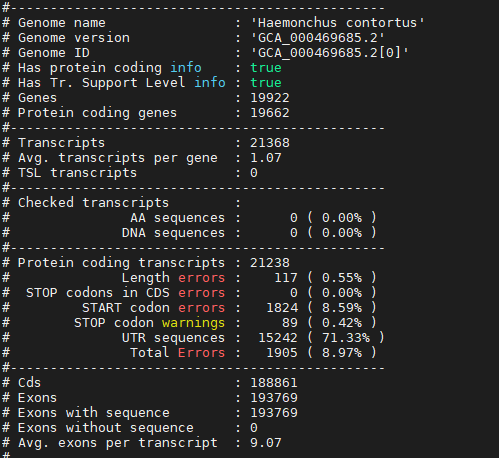
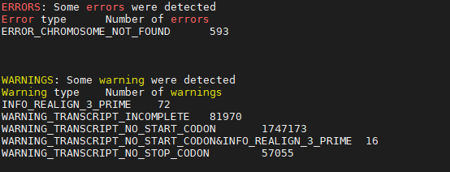
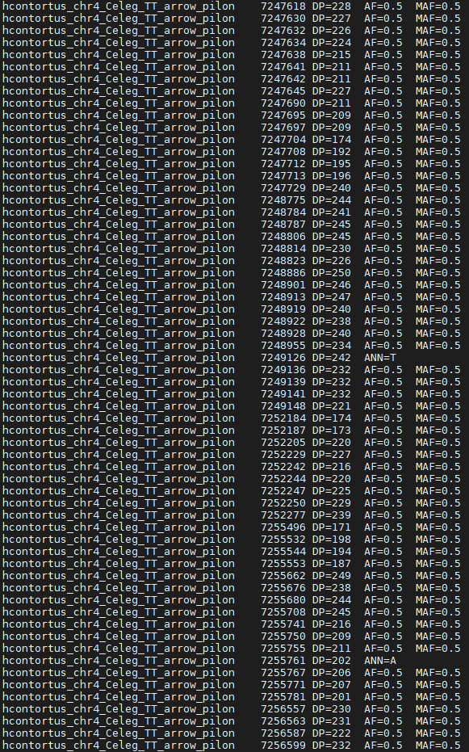

# Alignment, sorting and duplicate removal
The first step is aligning, sorting, indexing and removing duplicates from our alignment data
## Code
### Alignment, sorting and indexing
``` shell
#!/bin/bash -l
module load bioinfo-tools
module load bwa
module load samtools
module load picard
rec=/home/pauliusb/Cleandata/All_reads
bwa_db=/home/pauliusb/Haemonchus_2018_genome/BWA_all_genomes/haemonchus_cc
new_dir=/home/pauliusb/snic2020-16-116/alignment/WORKING_FOLDER
for sample in $rec/*R1.fq.gz
do
base=$(basename $sample R1.fq.gz)
echo "$base"
bwa mem -t 16 $bwa_db $rec/${base}R1.fq.gz $rec/${base}R2.fq.gz |
samtools view -b |
samtools sort --threads 8 -T temp > $new_dir/${base}R.bam
samtools index $new_dir/${base}R.bam

done
```
### Picard_tools and duplicate removal
```shell
for sample in $new_dir/*.bam
do
base=$(basename $sample .bam)
java -jar $PICARD_ROOT/picard.jar MarkDuplicates -I $sample -O $base.cleanreads.bam -REMOVE_DUPLICATES true -M .txt
samtools view -b -f 2 $base.cleanreads.bam > $base.final.bam
samtools sort $base.final.bam -o $base.final.sorted.bam
done
```
### Merging .bam files into (pre=I and post=P) two categories
``` shell
samtools merge merged.I.bam -b listI_bam_files.txt
samtools merge merged.P.bam -b listP_bam_files.txt
echo "finished"
```
### Indexing reference genome
``` shell
samtools faidx /domus/h1/pauliusb/Haemonchus_2018_genome/haemonchusnewest.fa
```
### SNP calling and quality filtering
``` shell
ref=/domus/h1/pauliusb/Haemonchus_2018_genome/haemonchusnewest.fa
for i in *.bam
do
  bcftools mpileup -Ou -f $ref $i | bcftools call -mv -Ob -o $i.bcf
  bcftools view -i '%QUA>20' $i.bcf -o $i.qual20.vcf
done
```
### Calculating MAF and AF for .vcfs
``` shell
bcftools +fill-tags merged.I.bam.qual.20.vcf -Ov -o merged.I.AF.vcf -- -t MAF,AF
bcftools +fill-tags merged.P.bam.qual.20.vcf -Ov -o merged.P.AF.vcf -- -t MAF,AF
```
### Creating Haemonchus c. database on snpEFF
``` shell
module load bioinfo-tools
module load snpEff/4.3t
java -jar $SNPEFF_ROOT/snpEff.jar build -c Heacon.config -dataDir Heacon_data -gff3 GCA_000469685.2
```
### SNP annotating
``` shell
for i in merged.*.AF.vcf
do
base=$(basename $i .AF.vcf)
java -jar $SNPEFF_ROOT/snpEff.jar -dataDir Heacon_data -c Heacon.config -v GCA_000469685.2 $i > $base.ann.vcf
done
```
#### Errors during annotating




### Extracting CHR, POS, DP, AF and MAF step-by-step
``` shell
more merged.I.ann.vcf | cut -f 1,2,4,5,8,10| sed 's/|/\t/g' | cut -f 1,2,3,4,5,6,7,8,9 | grep -v "intergenic\|stream\|UTR\|intron_variant" | cut -f 1,2,5 | sed 's/;/\t/g' | cut 1,2,3,17,18 > I_SNP_frequencies.table
```
#### looking into the frequencies table with less


