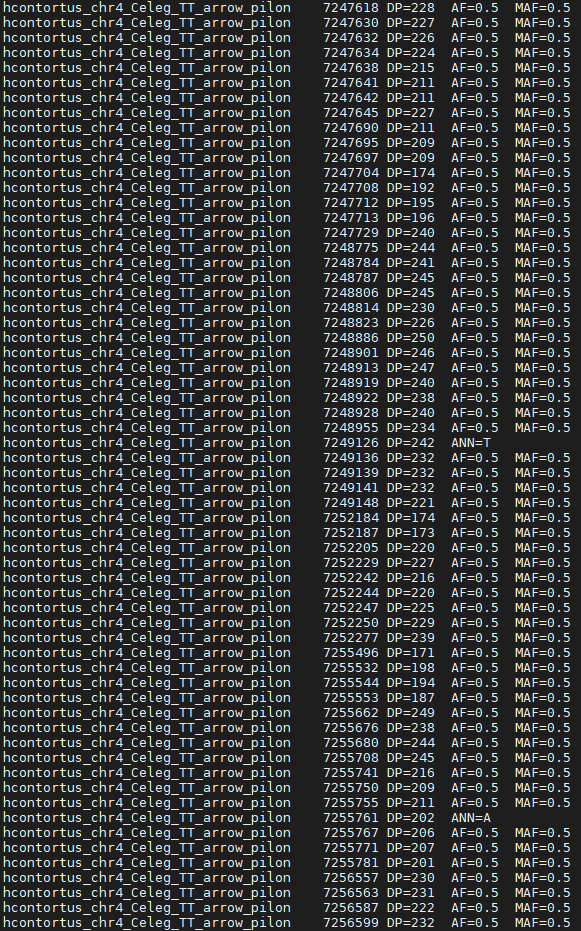

# Alignment, sorting and duplicate removal
The first step is aligning, sorting, indexing and removing duplicates from our alignment data
## Code
### Alignment, sorting and indexing
``` shell
#!/bin/bash -l
module load bioinfo-tools
module load bwa
module load samtools
module load picard
rec=/home/pauliusb/Cleandata/All_reads
bwa_db=/home/pauliusb/Haemonchus_2018_genome/BWA_all_genomes/haemonchus_cc
new_dir=/home/pauliusb/snic2020-16-116/alignment/WORKING_FOLDER
for sample in $rec/*R1.fq.gz
do
base=$(basename $sample R1.fq.gz)
echo "$base"
bwa mem -t 16 $bwa_db $rec/${base}R1.fq.gz $rec/${base}R2.fq.gz |
samtools view -b |
samtools sort --threads 8 -T temp > $new_dir/${base}R.bam
samtools index $new_dir/${base}R.bam

done
```
### Picard_tools and duplicate removal
```shell
for sample in $new_dir/*.bam
do
base=$(basename $sample .bam)
java -jar $PICARD_ROOT/picard.jar MarkDuplicates -I $sample -O $base.cleanreads.bam -REMOVE_DUPLICATES true -M .txt
samtools view -b -f 2 $base.cleanreads.bam > $base.final.bam
samtools sort $base.final.bam -o $base.final.sorted.bam
done
```
### Merging .bam files into (pre=I and post=P) two categories
``` shell
samtools merge merged.I.bam -b listI_bam_files.txt
samtools merge merged.P.bam -b listP_bam_files.txt
echo "finished"
```
### Indexing reference genome
``` shell
samtools faidx /domus/h1/pauliusb/Haemonchus_2018_genome/haemonchusnewest.fa
```
### SNP calling and quality filtering
``` shell
ref=/domus/h1/pauliusb/Haemonchus_2018_genome/haemonchusnewest.fa
bcftools mpileup --bam-list list_bam --min-MQ 30 --min-BQ 30 --adjust-MQ 50 -Ou -f $ref | bcftools call -mv -Ov -o IP_both.vcf
bcftools view -i 'QUAL>20 && DP>20' $i.bcf -o IP_both.qualdp20.vcf
done
```
### Retaining only INFO/DP4s to calculate allele frequencies for .vcfs
``` shell
bcftools annotate -x FORMAT,^INFO/DP4 merged.I.AF.vcf > dp4merged.I.ann.vcf
bcftools annotate -x FORMAT,^INFO/DP4 merged.P.AF.vcf > dp4merged.P.ann.vcf
```
### Creating Haemonchus c. database on snpEFF
``` shell
module load bioinfo-tools
module load snpEff/4.3t
java -jar $SNPEFF_ROOT/snpEff.jar build -c Heacon.config -dataDir Heacon_data -gff3 GCA_000469685.2
```
### SNP annotating
``` shell
for i in dp4merged.*.ann.vcf
do
base=$(basename $i .ann.vcf)
java -jar $SNPEFF_ROOT/snpEff.jar -dataDir Heacon_data -c Heacon.config -v GCA_000469685.2 $i > $base.ann.final.vcf
done
```
#### Errors during annotating


### Extracting CHR, POS, DP, DP4 and other important info step-by-step
``` shell
more dp4merged.P.ann.final.vcf | cut -f 1,2,4,5,8,10 | sed 's/|/\t/g'| cut -f 1,2,3,4,5,6,7,8,9 | grep -v "intergenic\|stream\|UTR\|intron_variant"| grep -v "##" | sed 's/;/\t/g' > P.merged.vcf
```
#### looking into the frequencies table with less



### Ggplot to make Allele frequency per POS plots
``` shell
library(tidyverse)
library(ggpubr)
I_split<-split(I, I$CHR)
I0<-I_split$`0`
I1<-I_split$`1`
I2<-I_split$`2`
I3<-I_split$`3`
I4<-I_split$`4`
I5<-I_split$`5`
I6<-I_split$`6`

P_split<-split(P, I$CHR)
P0<-P_split$`0`
P1<-P_split$`1`
P2<-P_split$`2`
P3<-P_split$`3`
P4<-P_split$`4`
P5<-P_split$`5`
P6<-P_split$`6`

I0_plot<-I0 %>%
  ggplot(aes(x=POS, y=ALT_FREQ))+
  geom_point(colour='gray')
I1_plot<-I1 %>%
  ggplot(aes(x=POS, y=ALT_FREQ, color=IMPACT))+
  geom_point()
I2_plot<-I2 %>%
  ggplot(aes(x=POS, y=ALT_FREQ, color=IMPACT))+
  geom_point()
I3_plot<-I3 %>%
  ggplot(aes(x=POS, y=ALT_FREQ, color=IMPACT))+
  geom_point()
I4_plot <-I4 %>%
  ggplot(aes(x=POS, y=ALT_FREQ, color=IMPACT))+
  geom_point()
I5_plot<- I5 %>%
  ggplot(aes(x=POS, y=ALT_FREQ, color=IMPACT))+
  geom_point()
I6_plot<- I6 %>%
  ggplot(aes(x=POS, y=ALT_FREQ, color=IMPACT))+
  geom_point()
  
P1_plot<-P1 %>%
  ggplot(aes(x=POS, y=ALT_FREQ, color=IMPACT))+
  geom_point()  
P2_plot<-P2 %>%
  ggplot(aes(x=POS, y=ALT_FREQ, color=IMPACT))+
  geom_point()  
P3_plot<-P3 %>%
  ggplot(aes(x=POS, y=ALT_FREQ, color=IMPACT))+
  geom_point()
P4_plot<-P4 %>%
  ggplot(aes(x=POS, y=ALT_FREQ, color=IMPACT))+
  geom_point()
P5_plot<-P5 %>%
  ggplot(aes(x=POS, y=ALT_FREQ, color=IMPACT))+
  geom_point()
P6_plot<-P6 %>%
  ggplot(aes(x=POS, y=ALT_FREQ, color=IMPACT))+
  geom_point()
P0_plot<-P0 %>%
  ggplot(aes(x=POS, y=ALT_FREQ))+
  geom_point()
ggarrange(I1_plot,I2_plot,I3_plot,I4_plot,I5_plot,I6_plot,I0_plot, P1_plot,P2_plot,P3_plot,P4_plot,P5_plot,P6_plot,P0_plot, ncol=7, nrow=2, common.legend = TRUE, legend = "bottom" ,labels=c("CHR1","CHR2","CHR3","CHR4","CHR5","CHR6", "CHRmt"))
```
### Allele frequencies of ALT per chromosome per position I (before; above) P (after; below)
 
 
